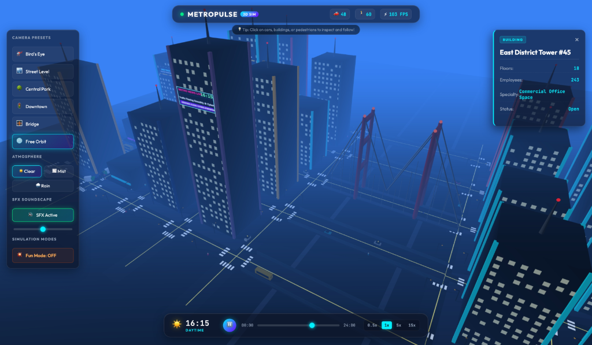

# 🏙️ MetroPulse 3D | Cyber-Modern Metropolis Simulation

> **Production status:** Pre-alpha under the GDD v3 completion roadmap. The MVP
> is scope-locked to West Core, Central Park, and the primary bridge. Aircraft,
> rocket launch, East-side development, countryside expansion, and unsafe
> Mayhem variants are retained behind default-off feature flags; their presence
> in source is not a release-completion claim. See
> [`docs/MVP_SCOPE.md`](docs/MVP_SCOPE.md) and
> [`docs/REQUIREMENT_TRACEABILITY.md`](docs/REQUIREMENT_TRACEABILITY.md).

[](https://threejs.org/)
[](https://vitejs.dev/)
[](https://opensource.org/licenses/MIT)



**MetroPulse 3D** is a browser-based hybrid cyberpunk city simulator and street-level action sandbox. Build and manage a living metropolis, then take direct control of pedestrians or physics-driven vehicles to explore, fight, hijack rides, and complete narrative missions. The shared treasury connects both loops: city growth earns passive income, while action missions deliver burst rewards that fund construction and district expansion.

## 🎮 Hybrid Game Loops

- **Management / Builder:** Zone parcels, place data-driven buildings and infrastructure, manage power/water/fire coverage, inspect spatial amenity/Mayhem land values, monitor City Pulse, and invest to unlock the East Cyber-Metropolis.
- **Persistent City Session:** Treasury, buildings, zoning, unlocks, mission progress, weather, time, overlays, and Mayhem state save locally and restore automatically, with explicit Save City and Start New City controls.
- **Action / Street:** Possess pedestrians, collect a baseball bat, hijack nearby vehicles, drive with `cannon-es` RaycastVehicle physics, trigger police response, and complete timed taxi, courier, race, delivery, sabotage, and survival missions.
- **Living Economy:** Placement and zoning costs, revenue, upkeep, service productivity, housing, jobs, unemployment, citizen happiness drivers, development demand, incidents, mission payouts, and narrative progress all flow through one observable economy model.
- **Mayhem Overlay:** Toggle comets, destruction, sirens, alerts, rubble, and satirical market feedback independently of the current management, builder, or action mode.

---

## ✨ Features

### 🌉 City Expansion: River, Grand Suspension Bridge & East District
- **Shimmering River Channel**: A 50-unit wide deep river basin bordered by concrete retaining walls flowing north-south across the entire length of the metropolis (`Z = -350` to `+350`).
- **Grand Suspension Bridge**: An iconic golden-gate styled suspension bridge spanning across the river at `Z = 0`. Built with towering 65-unit crimson steel pillars, glowing red beacon towers at night, swooping suspension cables, vertical suspender rods, a bi-directional vehicle road deck, and pedestrian sidewalks!
- **East District Cyber-Metropolis**: A massive urban expansion on the east bank (`X = 200` to `X = 350`) populated with 15+ new cyberpunk corporation skyscrapers (*Orbital Systems*, *Quantum Dynamics*, *Valkyrie Motors*, *Aether Skyspire*), neon storefronts, streetlamps, and plazas!
- **Seamless Cross-River Traffic & AI**: Autonomous vehicles and pedestrians seamlessly cross the river between the West and East districts along the bridge decks and sidewalks!
- **Bridge Camera Preset**: Jump straight to a breathtaking cinematic camera view (`🌉 Bridge`) of the suspension bridge and waterfront skyline!

### 🔥 Fun Mode: Apocalyptic Mayhem & Capitalist Satire
- **Flaming Comet Shower**: Toggle Fun Mode to transform the sky into an ominous orange-red apocalyptic horizon and unleash a chaotic rain of meteors!
- **Building Destruction to Rubble**: When a comet scores a direct hit on a skyscraper, the earth shakes with earthquake camera effects and the building is dramatically shattered into smoking concrete rubble!
- **Ominous Soundscape**: Blaring tornado sirens echo across the city alongside panicked crowd sound effects!
- **Satirical News Chyron**: A cyberpunk emergency news ticker overlay slides onto the bottom of the screen (`🚨 METROPULSE NEWS ALERT 🚨`), displaying continuous scrolling capitalist satire headlines mocking real estate values, inflation, and corporate synergy during extinction events!

### 🌅 Dynamic Day - Night & Atmospheric Engine
- **Time Slider & Clock**: Responsive 24-hour time slider (`00:00` to `24:00`) with real-time digital clock, time phase indicators (*Dawn*, *Daytime*, *Dusk*, *Nighttime*), play/pause time progression, and speed multipliers (`0.5x`, `1x`, `5x`, `15x`).
- **Orbital Sun & Moon**: Real-time orbital calculation for sun and moon positions casting dynamic shadows (`PCFShadowMap`).
- **Adaptive Retro Night Lighting**: A gradient indigo sky, softened stars, cool moon/ambient fill, warm street-level light pools, restrained emissive windows and vehicle lights, and time-aware exposure/bloom keep nighttime readable without losing the low-poly retro aesthetic. Dawn, dusk, rain, mist, and storms each preserve their own palette and visibility profile.
- **Automatic Night Illumination**: As dusk sets in (`18:00`), skyscraper window grids illuminate, bridge beacon towers pulse, streetlamps project warm cones of light onto the asphalt, neon storefronts intensify their bloom glow, and car headlights/taillights switch on!

### 🚗 Autonomous Traffic & Vehicle AI
- **48 Moving AI Vehicles**: Navigating an expanded multi-lane city, bridge, suburban, and countryside road graph with waypoint steering, turning at intersections, collision avoidance braking, stuck recovery, and automatic population replacement.
- **11 Distinct Vehicle Types**, including:
  - Sleek **Sedans** & aerodynamic **Sports Cars**
  - City Transit **Buses** & Delivery **Trucks**
  - City Yellow **Taxis**
  - **Police Cruisers** with dynamic flashing red & blue siren light bars!
  - **Ambulances**, **Ice Cream Vans**, **Dump Trucks**, and **Motorbikes**
- **Vehicle Safety & Recovery**: Oriented vehicle separation prevents traffic and player vehicles from clipping through one another. Turn-aware speed control, overshoot-safe waypoint advancement, obstacle sensing, and lane-corridor enforcement keep AI traffic on the road. User-driven vehicles recover to a verified safe road pose if they become immobilized or leave the supported terrain.
- **Pedestrian-aware Traffic**: Speed-aware look-ahead and braking let roughly 80% of AI drivers stop with clearance and remain stopped until a pedestrian clears their lane. The other 20% become impatient after a short delay, honk once, and proceed despite the obstruction.
- **NPC Hit-and-Run Pursuits**: When an AI driver strikes a pedestrian, the vehicle accelerates away while nearby available police activate their lights and sirens, select road-aware pursuit routes, and chase the moving offender before returning to regular patrol.
- **Impact Response**: Vehicle impacts throw pedestrians backward with speed-based knockback, vertical lift, spin, terrain-aware landing, and a timed recovery state.
- **Vehicle Fire & Chain Reactions**: Bat-damaged vehicles can ignite and explode. Nearby vehicles catch fire within the configured blast radius, explode after a delay, and remain as temporary wrecks before being culled and replaced so the moving traffic floor is preserved.
- **Realistic Physics & Animation**: Rotating wheel cylinders matched to driving speed and realistic deceleration.

### 🚶 Expressive Pedestrian Crowd Simulation
- **60 Varied Low-Poly Citizens**: Profile-driven skin tones, hairstyles, hats, clothing palettes, proportions, and accessories create a visibly broader population without duplicating model logic.
- **Pedestrian Archetypes**: Residents, professionals with briefcases, dedicated joggers, camera-carrying tourists, café readers, and suspicious troublemakers expose distinct activities and moods in the inspector.
- **Ambient City Life**: Joggers run sidewalk loops, tourists alternate between exploring and photographing landmarks, and seated patrons read books at furnished sidewalk cafés.
- **Bounded NPC Conflict**: Criminal NPCs periodically select an unclaimed nearby target, confront and punch NPCs or the user-controlled pedestrian, then disengage under strict range, duration, reservation, and cooldown rules.
- **Smart Walking AI**: Natural limb-swinging animation while walking along sidewalk loops and crosswalks.
- **Collision-safe Direct Control**: Controlled pedestrians use swept, sliding collision against active building, wall, lamp, and scenery physics bodies, including moved and rotated user-built structures.
- **Street-object Collision**: Parked vehicles, café tables, and café chairs participate in the shared collision registry, blocking pedestrians and player vehicles while also informing AI traffic avoidance.

### 🏢 Architecture & Custom Business Storefronts
- **Sleek Skyscrapers**: Glass towers with architectural bevels and procedural window grid room lights.
- **Distinct Commercial Storefronts**:
  - **NeoTech HQ**: Futuristic corporate tower with glowing blue ribs.
  - **CyberCafe 24/7**: Coffee shop with outdoor seating and neon mug signage.
  - **Apex Bank**: Classic modern stone facade with gold pillars.
  - **Starlight Hotel**: Luxury tower with entrance canopy and glowing magenta sign.
  - **Boba Haven**: Vibrant pastel tea lounge.
  - **Galaxy Cinema**: Entertainment complex featuring an animated marquee billboard.
- **Central Park**: An urban oasis featuring turf grass, diagonal walking paths, shade trees, benches, and a glowing neon water fountain.
- **Live 2D Canvas Billboards**: Live advertisements and a real-time digital clock/news ticker rendered directly onto 3D billboards!

### 🔊 Procedural Web Audio API Synthesizer
- Generates rich real-time city soundscapes with **zero external audio file dependencies**!
- **Daytime Soundscape**: Soft city rumble (low-pass filtered brown noise) and intermittent sine wave arpeggio bird chirps.
- **Nighttime Soundscape**: Deep ambient drone and nocturnal crickets (pulsed high-frequency triangle modulation).
- **Interactive SFX**: Sawtooth car honking, Doppler-effect police siren wail, tornado sirens, crowd panic, and UI sound feedback.

Traffic horns are also used contextually: a small subset of impatient AI drivers honk once at obstructing pedestrians, while collisions and emergency responses produce separate bump, siren, and warning cues.

### 👁️ Interactive Object Inspector & Follow Camera
- **Click-to-Inspect**: Click directly onto any moving car, pedestrian, or building to open a sleek HUD data card displaying live statistics (speed, battery level, employee count, business status).
- **Complete City Editing**: Place, select, move, rotate, and demolish user-built structures while keeping physics colliders, traffic roads, economy records, and saved state synchronized.
- **Follow Camera Mode**: Attach the camera to any moving vehicle or pedestrian to ride along with them across the suspension bridge and through the city streets!
- **Camera Preset Sidebar**: Instant camera jump buttons for *"Rocket Launchpad"*, *"Ground Level"*, *"Street Level"*, *"Bird's Eye View"*, *"Central Park"*, *"Downtown Intersection"*, *"Bridge"*, and *"Free Orbit"*. Terrain-aware camera clearance prevents orbit, chase, keyboard movement, transitions, and shake from clipping beneath roads, hills, bridges, or water. Elevated views use city-scale orbiting, while street-height views automatically switch to an in-place look pivot for precise road-level framing.
- **Weather Controls**: Run the automatic **Clear → Mist → Rain → Thunderstorm** cycle or choose weather manually. Wet conditions affect visibility, pedestrians, audio, surfaces, and player-vehicle grip.

---

## 🚀 Getting Started

### Prerequisites
- [Node.js](https://nodejs.org/) (`^20.19.0` or `>=22.12.0`, matching Vite 8)
- `npm` or `yarn`

### Installation & Local Development

1. **Clone the repository:**
   ```bash
   git clone https://github.com/hamilto8/metropulse_3D.git
   cd metropulse_3D
   ```

2. **Install dependencies:**
   ```bash
   npm install
   ```

3. **Start the local development server:**
   ```bash
   npm run dev
   ```

4. **Open in your browser:**
   Navigate to `http://localhost:5173/` in any modern WebGL-enabled browser.

### Building for Production

To create an optimized production build:
```bash
npm run build
```
The compiled bundles will be output to the `/dist` directory, ready for deployment to GitHub Pages, Vercel, Netlify, or any static hosting service.

To publish the current production build to the repository’s static GitHub Pages branch:

```bash
npm run deploy
```

This runs the production build first and publishes `/dist` to `gh-pages` using the repository base path `/metropulse_3D/`.

---

## 🛠️ Technology Stack
- **Core**: HTML5, Vanilla JavaScript (ES Modules)
- **3D Graphics Engine**: [Three.js](https://threejs.org/) (WebGLRenderer, OrbitControls, Shadow Mapping, InstancedMesh)
- **Styling & UI**: Vanilla CSS with modern Glassmorphism aesthetics (`backdrop-filter`, CSS variables, flexbox/grid)
- **Audio**: Native Web Audio API (`AudioContext`, procedural oscillators, filters, noise generators)
- **Build Tool**: [Vite](https://vitejs.dev/)

---

## 🎮 Controls & Usage Guide

Keyboard/mouse and Xbox controllers can be swapped at any time. The command ribbon detects the most recently used device, changes every visible prompt immediately, and shows only the actions relevant to Management, Builder, Driving, On Foot, or Dialogue. Controller stick drift is filtered so it cannot steal the active control scheme.

| Context | Keyboard & Mouse | Xbox Controller |
| :--- | :--- | :--- |
| **Management** | Drag to orbit, click to select, `Tab` to navigate controls, `F` for Builder, `M` to change mode | Right Stick to orbit, D-Pad to navigate, `A` to activate, View for Builder, Menu to change mode |
| **City Builder** | Move pointer to aim, click to place/apply, `R` rotate, `Delete` demolish, `Esc` back, `G` grid snap | Left Stick moves the placement reticle, `A` places/applies, `Y` rotates, `X` selects Delete, D-Pad navigates the catalog, `B` returns to the canvas or exits |
| **Driving** | `W/S` accelerate/brake, `A/D` steer, `Space` handbrake, `E` interact/exit, `Shift` horn/siren, right-drag look, `R` reset | `RT/LT` accelerate/brake, Left Stick steer, `A` handbrake, `Y` interact/exit, `LB` horn/siren, Right Stick look, `RB` camera, View reset |
| **On Foot** | `WASD` move, `Space` jump, `E` interact/hijack, click attack, right-drag look, `M` return | Left Stick move, `A` jump, `Y` interact/hijack, `X` attack, Right Stick look, `B` or Menu return |
| **Dialogue / UI** | `Tab` navigate, `Enter` confirm, `Esc` back | D-Pad navigate, `A` confirm, `B` back |

Time, weather, audio, overlays, camera presets, Mayhem, saving, and district controls remain available through the City Tools sidebar. On small screens it starts as a compact rail and expands on demand.

HUD regions are mode-aware: Mayhem news, adaptive controls, and simulation time use one collision-free command stack; market telemetry and vehicle speed occupy a separate right rail. City Tools collapses to a labelled rail during direct control and can be reopened without leaving the vehicle or pedestrian.

## ✅ Verification

```bash
npm test
npm run build
```

### Rendering performance diagnostics

MetroPulse starts at high visual quality and samples the measured frame rate once per second. Sustained performance below 45 FPS first selects the medium renderer (native CSS-pixel resolution, shadows retained, bloom bypassed). If performance remains below 38 FPS, the low renderer also reduces the drawing-buffer scale, disables dynamic shadows, and removes live backdrop blur over the WebGL canvas. Recovery uses a longer, higher threshold so quality does not oscillate.

For a repeatable comparison, `?quality=high`, `?quality=medium`, or `?quality=low` locks a tier and disables automatic switching for that session. For example:

```text
http://localhost:5173/?quality=low
```

On Windows, check `chrome://gpu` (or `edge://gpu`) when a high-end discrete GPU performs unexpectedly poorly. WebGL should be hardware accelerated and the renderer should name the installed GPU rather than SwiftShader, llvmpipe, or Microsoft Basic Render. MetroPulse also prints the detected WebGL renderer at startup and warns when it recognizes a software renderer.

The Node test suite covers game-mode transitions, economy and service invariants, mission validation and lifecycle, physics cleanup and wet-weather grip, timed hijacking, chase mouse-look, Mayhem collider recovery, crime/wanted behavior, population floors, congestion metrics, bridge priority, custom-bridge traversal, editor-road graph integration, vehicle separation and recovery, vehicle fire-chain cleanup, pedestrian yielding and honking, pedestrian knockback, adaptive control bindings, input-context priority, controller edge handling, and stick-drift rejection.

The interface includes keyboard-visible focus treatment, spatial D-Pad focus navigation, semantic editor controls, modal focus containment, reduced-motion support, a compact no-overflow mobile editor layout, and a recoverable collapsed City Tools rail. Management, building, driving, walking, missions, and dialogue support live keyboard/mouse ↔ Xbox switching.

---

## 📄 License
This project is open-source and available under the [MIT License](LICENSE).
